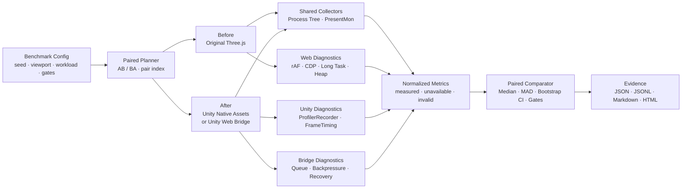

<div align="center">

# Three.js → Unity Performance Benchmark

**跨浏览器与 Unity Player 的公平、配对、可审计性能基准。**

同一工作负载 · 156 项指标 · 动态进程树 · 可选 PresentMon · AI 原生 CLI

[](package.json)
[](package.json)
[](unity-package/README.md)
[](docs/METRICS.md)
[](docs/AI_CLI.md)
[](LICENSE)

[快速开始](#快速开始) · [真实游戏验证](#真实游戏验证) · [156 项指标](#156-项指标) · [AI-friendly CLI](#ai-friendly-cli) · [文档导航](#文档导航)

</div>

> [!NOTE]
> 本项目是**性能测评器**，不是 Three.js → Unity 转换器。它接收已经可以运行的原始 Web build 与 Unity Player，在同一实验协议下采集、比较并保存证据。

直接把浏览器 `requestAnimationFrame` 和 Unity 内部帧耗时放进一张“转换前后 FPS 表”会得到漂亮但错误的结论。本工具将跨运行时共同指标、运行时内部诊断和工作负载等价性分开处理；缺失数据保持 `unavailable`，不会补成 `0` 或偷偷换用另一种 counter。

## 为什么需要它

| 公平实验 | 全栈采集 | 可审计统计 | AI 原生 |
|---|---|---|---|
| 同 seed、分辨率、质量、场景与测量窗口 | Web、Unity、进程树、PresentMon、Bridge、产物 | 配对中位数、MAD、bootstrap 95% CI | JSON/JSONL、Schema、明确 exit code |
| AB/BA 交替运行，按 pair index 对齐 | 动态跟踪浏览器、Host、WebView 和 Player 子进程 | 缺测不补零，来源、单位和覆盖率可追溯 | `capabilities → plan → doctor → run` |

它明确区分三件经常被混在一起的事：

1. 两个版本是否执行了**同一个工作负载**并正常完成；
2. 用户可感知的帧呈现、总 CPU、总内存是否改善；
3. Web、Unity、渲染器或桥接层的哪个子系统解释了变化。

> [!IMPORTANT]
> `pass` 只表示配置中的 gate 通过，不表示每一个性能指标都比转换前更好，也不自动证明视觉、输入、音频、存档或玩法等价。

## 支持的对照类型

| Variant | 用途 | 解释边界 |
|---|---|---|
| `threejs-original` | 原始 Three.js/Web 基线 | 通常作为 `before` |
| `unity-native-assets` | 导入 Unity 的原生资产/场景 | 若游戏逻辑没有同步迁移，只能叫原生场景切片 |
| `unity-web-bridge` | Unity 内嵌或托管原始 Web 游戏 | 必须计入 Player、Host、WebView 等整个进程树 |
| `custom` | Web-vs-Web 控制组或自定义目标 | 需要自行保证共同工作负载与口径 |

## 工作原理



跨运行时主结论优先使用双方共享的动态进程树 CPU/内存，以及可选的 PresentMon 呈现数据。`web.*`、`unity.*`、`render.*` 和 `bridge.*` 保留为诊断证据，不会被强行合成同一种指标。

## 真实游戏验证

2026-08-31 验证快照：Windows 11、Ryzen 9 7940HX、RTX 4060 Laptop GPU、32 GB RAM、Unity `6000.3.22f1` / D3D12、Edge `152.0.4191.53`。实验统一为 1280×720、180 FPS cap、3 秒 warm-up、10 秒 measurement、5 个 AB/BA 配对。

- 3 个结构不同的真实开源 Three.js 游戏；
- 3 个 `.threeunity` v6 原生场景 Player + 1 个完整保真 Web Bridge Player；
- 40/40 次正式运行、20/20 个配对、0 crashes；
- Benchmark Node tests 30/30 通过。

<details>
<summary>样本与固定源码版本</summary>

- [Voxel Frontier](https://github.com/Sunwood-ai-labs/threejs-voxel-frontier/tree/63e455d0280dd68b1c7e7fec8b2f4fba2012df7f)，ISC；覆盖 4,640 个实例的 InstancedMesh 场景。
- [LittleCubes](https://github.com/paugm/LittleCubes/tree/7d1ff0c24e476c11771953f9ac2ea9be1e8ca552)，MIT；覆盖 295,784 顶点的高几何量场景。
- [Warptracker](https://github.com/ilrein/warptracker/tree/71bbfbdfacd118196994b26da68eec1876d55c6b)，MIT；覆盖 2,223 节点、693 meshes、15 textures 和 104 skins。

</details>

### Native Scene Slice

> [!CAUTION]
> 下表衡量捕获后的原生 Unity 场景切片。它们没有执行完整 JavaScript 游戏逻辑、DOM UI、音频、AI、物理或存档，因此**不是完整游戏提速结论**。

| 游戏 | CPU 降低 | Bootstrap 95% CI | 峰值内存降低 | Bootstrap 95% CI | Web dist → Unity build |
|---|---:|---:|---:|---:|---:|
| Voxel Frontier | 59.00% | 53.04%–63.45% | 24.87% | 24.28%–25.44% | 0.55 → 85.91 MiB |
| LittleCubes | 74.77% | 71.12%–75.72% | 29.45% | 29.13%–30.19% | 1.55 → 97.89 MiB |
| Warptracker | 91.92% | 90.42%–92.32% | 38.67% | 37.95%–40.02% | 4.08 → 109.10 MiB |

### Full-fidelity Web Bridge Control

Voxel Frontier 的原始 `dist` 被逐路径、逐字节保留在 Unity Web Bridge 中，用来测量保留浏览器游戏时 Unity 容器本身的成本。

| 指标 | Original Web | Unity Web Bridge | 配对变化，bootstrap 95% CI |
|---|---:|---:|---:|
| Mean CPU，100% = 一个逻辑核 | 41.81% | 76.13% | **增加 82.10%** [56.32%, 112.45%] |
| CPU time / 10 s | 4.133 s | 7.108 s | **增加 78.52%** [54.84%, 107.64%] |
| Peak working set | 518.61 MiB | 814.23 MiB | **增加 56.98%** [52.10%, 57.58%] |
| Package size | 0.55 MiB | 247.37 MiB | **452.59×** |

完整保真组完成 10/10 runs、5/5 pairs，所有 Player 日志均到达 page ready、page stable、measurement result 和 clean stop；没有 Host fault、relaunch 或残留 Player/Host。它说明当前 packaging-only Web Bridge 保留了浏览器运行时，也增加了 Unity shell，因此不会获得 Native Scene Slice 的资源下降。

原始 per-game 报告和 Player 属于本地忽略的集成证据，没有把游戏产物提交到本仓库。上表是验证快照，不是随 npm 分发的 benchmark dataset。

## 156 项指标

指标注册表是一个可查询的版本化契约：

```bash
three-unity-perf --json metrics
three-unity-perf --json metrics --priority P0
```

| 类别 | 数量 | P0 | P1 | 主要来源 |
|---|---:|---:|---:|---|
| Frame | 29 | 28 | 1 | PresentMon / cadence |
| CPU | 12 | 10 | 2 | Process tree / PresentMon |
| GPU | 10 | 10 | 0 | PresentMon / Windows GPU counter contract |
| Memory | 11 | 8 | 3 | Dynamic process tree |
| Stability | 10 | 8 | 2 | Runner / scenario / lifecycle |
| Startup | 4 | 4 | 0 | Runner / PresentMon |
| Web | 39 | 0 | 39 | Performance API / CDP / Playwright |
| Unity | 9 | 0 | 9 | ProfilerRecorder / FrameTimingManager |
| Render | 10 | 0 | 10 | Three.js / Unity renderer diagnostics |
| Bridge | 14 | 0 | 14 | Versioned bridge telemetry |
| Artifact | 8 | 0 | 8 | Web build / Unity build / `.threeunity` inventory |
| **总计** | **156** | **68** | **88** | |

其中 80 项在满足相同 workload、source、unit 和采样条件时允许跨目标比较，14 项带默认 gate 建议。`156` 是指标契约数量，不表示每个平台、Player 或驱动都能产生全部 counter；每个结果都携带 `status`、`source`、`unit`、`sampleCount`、`coverageRatio` 和不可用原因。

已注册但当前没有通用数据源的指标——例如 portable private bytes、进程树 GPU 利用率/显存、部分 startup/lifecycle counter——会保持 `unavailable`。完整接线状态见 [docs/METRICS.md](docs/METRICS.md)。

## 快速开始

要求 Node.js 20+。当前仓库按源码使用，尚未声明已发布到 npm。运行真实 A/B 之前，请先用你的转换工具准备好可访问的 Three.js build 和已构建的 Unity Player。

```bash
git clone https://github.com/mohui666/threejs-unity-benchmark.git
cd threejs-unity-benchmark
npm ci
npm run build
npm link
```

```bash
# 1. 探测当前平台和采集器能力
three-unity-perf --json capabilities
three-unity-perf --json metrics --priority P0

# 2. 创建 config 和 scenarios/benchmark.mjs
three-unity-perf --json init --out ./benchmark/benchmark.config.json

# 3. 检查解析后的 AB/BA 顺序，不启动目标
three-unity-perf --json plan --config ./benchmark/benchmark.config.json

# 4. 检查本配置真正要求的目标和 collector
three-unity-perf --json doctor --config ./benchmark/benchmark.config.json

# 5. 执行并流式输出机器可读进度
three-unity-perf --jsonl run \
  --config ./benchmark/benchmark.config.json \
  --out ./.bench-results/current
```

不执行 `npm link` 时，将 `three-unity-perf` 替换为 `node ./dist/cli.js`。完整示例见 [examples/threejs-vs-unity.config.json](examples/threejs-vs-unity.config.json)；配置同时支持 JSON 与 YAML。

### 配置的四个核心部分

```json
{
  "$schema": "../schemas/config.schema.json",
  "schemaVersion": "1.0.0",
  "experiment": {
    "name": "Three.js vs Unity",
    "seed": 20260831,
    "viewport": { "width": 1920, "height": 1080 },
    "frameBudgetMs": 16.6667,
    "warmupMs": 15000,
    "measureMs": 60000,
    "repetitions": 7,
    "runOrder": "alternating"
  },
  "targets": {
    "before": {
      "id": "threejs-original",
      "runtime": "web",
      "variant": "threejs-original",
      "url": "http://127.0.0.1:4173",
      "ready": { "type": "web-expression", "expression": "globalThis.gameReady === true" }
    },
    "after": {
      "id": "unity-converted",
      "runtime": "unity",
      "variant": "unity-native-assets",
      "executable": "../Build/ConvertedGame.exe",
      "ready": { "type": "log", "pattern": "^BENCHMARK_SCENE_READY$" }
    }
  },
  "scenario": { "adapter": "./scenarios/benchmark.mjs" },
  "collectors": {
    "web": { "enabled": true, "required": true },
    "unity": { "enabled": true, "required": true },
    "processTree": { "enabled": true, "required": true },
    "presentmon": {
      "enabled": true,
      "required": true,
      "options": { "binaryPath": "C:/Tools/PresentMon/PresentMon.exe", "metricsVersion": "v2" }
    }
  }
}
```

上面只展示核心结构；实际项目还应填写 Web 启动命令、场景参数、产物路径和 gates。Starter 默认把 PresentMon 设为 required，因为默认 frame gates 使用共同的呈现口径；不能一边关闭 PresentMon，一边保留 required `frame.cadence.*` gate。

## 公平实验协议

1. 固定机器、电源模式、显示器、驱动、分辨率和窗口模式；
2. 固定垂直同步、FPS cap、质量档、随机种子和内容版本；
3. A/B 使用相同相机轨迹、输入序列、对象数量和完成条件；
4. 先等待各自真正 ready，再执行共同 warm-up 与 measurement；
5. 每个 repetition 形成同 index 的 pair，推荐 `AB, BA, AB, BA...`；
6. 普通推断 gate 至少需要 5 pairs；稳定性 hard invariant 每次 after run 都检查；
7. 报告每侧 median、MAD、paired delta/improvement 和固定 seed bootstrap 95% CI。

若 A/B 内容或行为不同，工具仍能准确测量两个进程，但那不是有效的转换性能结论。

## 场景适配

Web 场景模块可以导出 `prepare`、`run`、`validate` 和 `cleanup`：

```js
export async function prepare({ page }) {
  await page.waitForFunction(() => globalThis.gameReady === true);
}

export async function run({ page, seed, parameters }) {
  await page.evaluate(
    ({ seed, parameters }) => globalThis.runBenchmarkScenario(seed, parameters),
    { seed, parameters }
  );
  await page.evaluate(() =>
    globalThis.__THREE_UNITY_PERF__.checkpoint("scenario-complete", true)
  );
}

export async function validate({ page }) {
  return page.evaluate(() => ({ completed: globalThis.scenarioFinished === true }));
}
```

Three.js 页面可以发布 `renderer.info`：

```js
import { publishThreeRendererInfo } from "threejs-unity-benchmark/web";

publishThreeRendererInfo(renderer);
```

Unity 不执行 Web adapter。转换后的场景必须通过同一 seed/参数自行启动等价 workload，并发出相同完成检查点。

## Unity 接入

将仓库内的 `unity-package` 作为 UPM 包安装：

```text
https://github.com/mohui666/threejs-unity-benchmark.git?path=/unity-package
```

Probe 默认完全休眠。只有 CLI 启动 Player 并追加 `--three-perf-output`、run ID、warm-up 和 measurement 参数时，它才会在 `BeforeSceneLoad` 创建采集对象。

```csharp
using ThreeUnity.Performance;

ThreeUnityPerformance.Checkpoint("scenario-complete", true);
```

若要等场景真正可玩后再 warm-up，给 Unity target 配置 log ready：

```json
{
  "ready": {
    "type": "log",
    "pattern": "^BENCHMARK_SCENE_READY$",
    "timeoutMs": 60000
  }
}
```

Web Bridge 应等待稳定的页面/桥接 marker，而不是只等待 Player 进程出现。具体 Probe 参数与兼容性见 [unity-package/README.md](unity-package/README.md)。

## PresentMon：共同帧呈现口径

Windows 上可使用 [PresentMon](https://github.com/GameTechDev/PresentMon) 为 Web 与 Unity 提供相同的 displayed-present 口径。CLI 不下载、不搜索、不提权运行二进制，必须显式提供路径：

```json
{
  "presentmon": {
    "enabled": true,
    "required": true,
    "options": {
      "binaryPath": "C:/Tools/PresentMon/PresentMon.exe",
      "metricsVersion": "v2"
    }
  }
}
```

Unity Web Bridge 的呈现可能发生在 `msedgewebview2.exe`。可通过 `processNames` 同时包含浏览器、Player、Host 与 WebView 进程名；runner 会再按本次动态进程树 PID 过滤，避免混入其他同名实例。

当前仓库使用 v1/v2 fixtures 验证了解析、主 swap chain 选择和统计归一化。真实验证机上的 PresentMon 2.5.1 因当前进程未提权而没有产生 ETW CSV，因此正式游戏 suites 主动禁用了 PresentMon，未声称共享 FPS、GPU frame time、display latency 或 dropped-present 结论。

## AI-friendly CLI

主命令为 `three-unity-perf`，等价别名为 `threeunity-bench`。

| Command | 作用 |
|---|---|
| `init` | 创建 starter config 与 scenario adapter，不覆盖已有文件 |
| `capabilities` | 查询平台、collector 和跨运行时能力 |
| `metrics` | 查询 canonical metric ID、unit、direction、priority 与 gate |
| `schema` | 返回 `config`、`run`、`comparison`、`cli-result` JSON Schema |
| `plan` | 解析配置并返回精确 pair/AB/BA 顺序，不启动目标 |
| `doctor` | 只检查本配置实际需要的目标与 collector |
| `run` | 执行完整 suite、比较并生成报告 |
| `compare` | 离线比较已有 run/suite JSON |
| `report` | 从 suite/comparison 重建 Markdown、HTML 或 JSON |

```bash
three-unity-perf --json capabilities
three-unity-perf --json schema config
three-unity-perf --json metrics --priority P0
three-unity-perf --json plan --config benchmark.config.json
three-unity-perf --json doctor --config benchmark.config.json
three-unity-perf --jsonl run --config benchmark.config.json
three-unity-perf --json compare before.json after.json --out comparison.json
three-unity-perf --json report suite.json --format html --out report.html
```

- `--json`：stdout 恰好一个最终 envelope，progress 写入 stderr；
- `--jsonl`：stdout 依次输出 progress events 和最终 envelope；
- `schemaVersion: "1.0.0"`：解析 `data` 前先检查版本；
- `artifacts`：返回后续可读取证据的绝对路径。

```json
{
  "schemaVersion": "1.0.0",
  "command": "run",
  "ok": true,
  "status": "pass",
  "data": { "pairCount": 5, "runs": 10 },
  "artifacts": ["C:/benchmark/suite.json"],
  "warnings": [],
  "errors": []
}
```

| Exit | Status | Agent 应如何处理 |
|---:|---|---|
| 0 | pass | 读取 artifacts 与关键 metrics |
| 1 | regression | 报告失败 gate，不要重试成“成功” |
| 2 | inconclusive | 报告缺少的 pairs、samples、coverage 或 source |
| 3 | input error | 修正参数、配置或 schema 请求 |
| 4 | doctor failed | 根据 `data.checks` 修复依赖/路径 |
| 5 | target failed | 检查 Unity exit、Player log 和已有 artifacts |
| 6 | collector failed | 修复 required collector，不得把缺测当结果 |

推荐 Agent 流程：

```text
capabilities
  → schema + metrics
  → init
  → plan
  → doctor
  → run --jsonl
  → inspect suite.json / comparison.json
  → report
```

Agent 不应把 `unavailable` 变成 `0`，不应合并 Web rAF 与 Unity internal frame time，不应把少于 5 pairs 描述成推断结论，也不应把 HTML 成功生成等同于 benchmark pass。完整契约见 [docs/AI_CLI.md](docs/AI_CLI.md)。

## 输出与证据

```text
.bench-results/<suite-id>/
├── suite.json
├── comparison.json
├── report.md
├── report.html                    # 自包含，不依赖外部 CDN
└── runs/
    └── <target-id>-<pair>/
        ├── run.json
        ├── raw.json
        ├── samples.jsonl
        ├── presentmon.csv         # 启用且可用时
        ├── *.unity-probe.json     # Unity target
        ├── *.unity-player.log     # Unity target
        └── server.log             # CLI 启动 Web 服务时
```

`suite.json` 是完整索引，`comparison.json` 保存配对统计，`samples.jsonl` 保留时间序列，Markdown/HTML 用于人工审阅。报告不会丢弃原始 collector 状态、来源和不可用原因。

## 当前验证边界

- 已验证 TypeScript build、30/30 Node tests、真实 Edge Web collector、Unity `6000.3.22f1` package/Player、4 个 StandaloneWindows64 Player 和 40 次正式运行；
- Unity package 声明兼容 `2021.3`，但该版本当前只有 API 条件编译与静态检查，没有对应 Editor/Player 实机证据；
- PresentMon 真实 ETW 采集尚未在当前非提权会话中完成；
- Unity draw-call、batch、triangle recorder 曾在非空场景返回 `0`，该结果被视为无效渲染证据；
- 长时内存增长率只在至少 60 秒 measurement window 下计算；
- 自动化日志不能替代 Game View 的视觉、输入、音频与玩法验收；
- `examples/smoke.config.json` 是 Web-vs-Web 控制组，只验证采集/报告链路，不是转换性能结论。

## 开发

```bash
npm run check
npm run smoke:web
```

`npm run check` 执行 TypeScript build 与全部 Node tests；`npm run smoke:web` 运行真实浏览器控制组并生成一套完整报告。

## 文档导航

- [指标字典与接线状态](docs/METRICS.md)
- [架构、来源和统计边界](docs/ARCHITECTURE.md)
- [AI CLI、Schema 与 exit code](docs/AI_CLI.md)
- [Unity Runtime Probe](unity-package/README.md)
- [完整 A/B 配置示例](examples/threejs-vs-unity.config.json)
- [Web-vs-Web smoke 配置](examples/smoke.config.json)

## License

[MIT](LICENSE)

---

**English summary:** A paired, deterministic and auditable benchmark runner for an original Three.js application and its Unity counterpart. Shared process-tree/PresentMon metrics support cross-runtime conclusions; Web, Unity, renderer and bridge internals remain explicit diagnostic sources. The versioned JSON/JSONL CLI is designed for both humans and agents.
